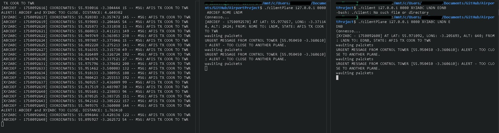

# Airport Project

* Both server and clients need to be compiled with the -lm linked library (due to the cos and sin functions)
  * `gcc ./src/serverControlTower.c -lm -o ./server`
  * `gcc ./src/clientPlane.c -lm -o ./clientPlane`
* usage example for the server: `./serverTower 8080 ABCD`
* usage example for the clients: `./clientPlane 127.0.0.1 8080 XYZRPG ROME LNDN`
* most functionalities are a work in progress!

## Functionalities

### Libraries
#### protocolStructures.h
The structures I define are as follows: 
* TYPE_PAYLOAD is an enum: these represent the kind of messages which can be exchanged between Client (planes) and Server (control Tower). There are 3 kinds of messages: Data (What the Client-Plane sends to the Server-ControlTower on first contact), Alert (can be exchanged both from the Tower to the Client and viceversa, simulates important alerts), and Coordinates (The structure which holds coordinates, sent from the plane to the control Tower).
* The AirplaneInfo struct holds informations about the plane; such as flightcode, timestamp, lat, long, alt, departure, arrival, and a message (also used as padding so that all three structures have the same size); the AlertData has flightcode, Timestamp, alertlevel, and a bigger message. 
* **The package struct is what is actually being exchanged between planes and controlTower**; it contains a TYPE_PAYLOAD type and a payload which is exactly 64 bytes long - these bytes will be memcpy-ed into any of the other structures, depending on the TYPE_PAYLOAD value. 
* The Coordinates, albeit being one of the TYPE_PAYLOADs structures, is defined in the following library 

#### coordinatesMethods.h
This library consists of all the assisting methods and data structures I used to assign coordinates to planes - note that at the time of speaking, I have not yet implemented a normal, plane-like movement, but the planes teleport on random places around the radius which has as center the controlTower. Fixing this is part of the TODO list.
* The Coordinates structure contains planecode, latitude, longitude, altitude, planetimestamp, and a message - this is what will continuously be sent from the planes towards the controlTower as they are active and running.
* Then the library contains a bunch of methods which are useful to calculate latitude and longitude and a method which calculate a distance in meters between two different lat-long coordinates (this is a standard kind of measurement used in other context, I have not written this from scratch)
* There are other methods which generate data which correspond to the coordinates which the plane will send to the Tower! The random coordinates which I mentioned before.

#### lib-misc.h
Useful small error-handling utilities (from the Operating Systems course)

### clientPlane
This file contains the code of the clients-planes. I create a socket and then connect it - and then initialize the plane's structures through a specific **initStructures function**.
* The client-plane will have an **Airplane_status structure** which contains the current state of the plane: this is accessed with a **mutex to prevent race conditions** between the method which changes its coordinates and the plane which sends its coordinates to the tower.
* This function will give it random coordinates with methods from teh abovementioned Coordinates library, then create an AirplaneInfo structure - I use strcpy for strings. I then use the mutex to change the global AirplaneStatus structure. The function also prints the informations of the plane when creating it, for good measure. 
* In the main, I then create a package (the standard way of sending information in this project) and I assign it the type MSG_DATA; i memcpy the airplane info in the packet before sending it to the server. 
* I then create three threads
  * One of them, **threadPosition**, continuously (every 3 seconds) changes the position of the plane as mentioned before, and updates the airplaneStatus - using a mutex to avoid race conditions - as it does
  * One of them, **threadReceive**, listens for any packets from the control tower. It can only recognize and correctly read messages with the MSG_ALERT type. As we'll see, these will be sent when the CtrlTower sees that two planes are too close to each other.
  * The last thread, **threadSend**, will continuously (every 3 seconds) pack the current coordinates stored in the airplaneStatus inside a package, and send them to the ControlTower. These will be sent with MSG_COORDINATES as TYPE_PAYLOAD. 
  * If the server is closed, then the clients will close. At the end, I join all threads, destroy the mutex, close the socket, and return 0.
### serverControlTower
This file contains the code of the server. It has a tracked_plane structure which contains the data of any tracked plane, and another structure called planes_list which contains an array of all the tracked planes, a counter of the tracked planes, and a mutex to access the tracked planes. Count starts at 0.
* The Tower checks the initial arguments, then tries to initialize the server through the **create_server** function. The latter does all the work of creating the socket, populating the sockaddr_in structure, binding, listening, and then it returns the file descriptor of the socket.
* I then start a thread, **threadChecks**, which - once there are at least 2 tracked planes - will check (every 3 second) the distance between them, and send a package with TYPE_PAYLOAD MSG_ALERT to these two planes. This check will have to be executed within the critical section governed by the planes_list mutex, because the number of planes might change as the method runs.
* The server then enters a loop to manage the planes. For each new plane connected to the tower it starts a thread, **threadAirplane**, which manages the messages received by it; at the first contact, it will up the counter. This method also manages the procedure of when a plane disconnects (by shifting the array which contains the tracked planes), and it will manage and print the packages sent by the planes. The status of all the planes (such as the coordinates) is updated under a mutex. 

### tempWorkBench
This is a temporary workbench to test functionalities and sizes without breaking everything in the other files.

## The Plan
Aka "The Roadmap", more or less
* A thread checks positions of planes
	* It has to figure out if two or more are within 500m of each other
		* If so, the control tower sends a message to both, alerting them
			* The planes should change course in order to put distance between each other
	* If a plane is out of a certain range from the control tower, then it disconnects from it 
		* *(Presumably it will, in its journey, connect to another one)*
	* Therefore, control tower must have a Lat and a Long (its own position)
* **control tower**: `thread receiving` airplane data and-or messages
	* ControlTower can receive a message which can either be interpreted as DATA or as MESSAGE depending on a `TYPE_PAYLOAD enum`.
		* Both DATA or ALERT payloads should be 64Bytes, which makes the whole thing work with `memcpy()`
			* Assigning the memory to the correct struct when identifying the type
	* Should it broadcast data / alerts to all other planes? 
	* Maybe all-time broadcast is too much. It could be a broadcast mode which could be activated in the "danger-zone" areas (when planes are either on the ground or close)
		* Implies the existence of a "DangerMode" where all planes go crazy receiving many alerts... will think this through, or get inspiration from actual real-life control tower dynamics perhaps  
* **control tower**: `thread sending` airplane messages and-or commands 
* **control tower**: `thread checking` position of planes, checking if plane positions are dangerously close to each other
	* Must access latter plane data in a mutually exclusive way
* **plane**: `thread sending` airplane data to the control tower
* **plane**: `thread receiving` messages and commands from the ground
* Easter egg...

### Later features, maybe
* *Later*: might have the user select direction of plane movement
* *Later*: might have a control tower signal to another control tower the fact that there's a plane headed there, which is departing from the current control tower
	* Server-to-Server connection (TCP)
* *Later*: plane asks for roger to land in the airport 